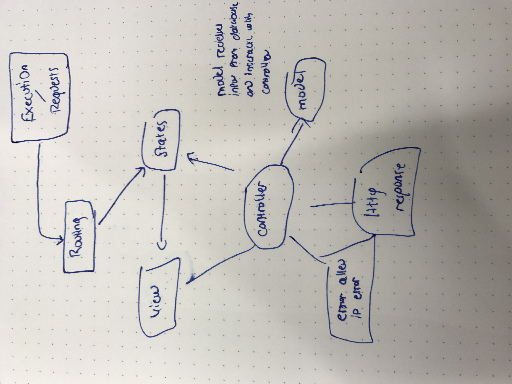

# Assignment 5: Using our server API and implementing state on the front-end
In this final assignment, we will work on integrating the back-end with our Angular code, and also making the client-side code more modular by introducing the concept of state. 

### Using $http to make requests 
Now that we have created a server that handles all the CRUD tasks associated with directory listings, we are ready to incorporate this into the Angular application. The [$http](https://docs.angularjs.org/api/ng/service/$http) service makes it possible to make requests to retrieve data from an external source. Calls to $http are asynchronous, so we again must handle the data they retrieve through callbacks. Here is a sample GET request from the AngularJS docs: 

```javascript
$http({
  method: 'GET',
  url: '/someUrl'
}).then(function successCallback(response) {
    // this callback will be called asynchronously
    // when the response is available
  }, function errorCallback(response) {
    // called asynchronously if an error occurs
    // or server returns response with an error status.
  });
```

If you take a look at the listing factory, you will notice that it is no longer returns a JSON object, but rather has methods that allow us to retrieve the same data from our server through requests made via $http. If you navigate to the controller, you will see some examples of how the factory's methods are used to handle the asynchronous requests to our server API. You will be responsible for fully integrating the front-end with the server to provide a user interface to view, create, update, and delete listings. 

### Angular-UI Router
We will use [**Angular-UI Router**](https://github.com/angular-ui/ui-router/wiki), which is a framework that allows us to implement client-side routing with the concept of state. 

On the server-side, the concept of "routing" refers to how Express handles requests made to the API. On the client-side, "routing" stands for something slightly different. In our application, the user will have several views that they can navigate to (a list view, individual listing view, map view, etc). Each of these parts of the user interface can be considered a specific **state** of the application. When I navigate to the map view, the applications "state" could be associated with displaying a map. 

Ideally, these states should have a URL associated with them. If a user is to type `www.directoryapp.com/listings/map` in the browser, they should see the map view discussed previously. This is where client-side routing differs from server-side routing. On the client-side, each URL is associated with a *specific application state*. 

Go to the routes defined in the client-side config folder. You will notice there are several states associated with different views. 
- If I were to type `http://localhost:8080/listings` into the browser, the UI-Router code defined in the routes should take me to the state `listings.list`
- Now take a look at the view associated with `listings.list`. When this view is initialized, a call is made to the server to retrieve all listings via the `find()` method defined in the `ListingsController`, and the view is populated with the results of this call.

View [this tutorial](https://scotch.io/tutorials/angular-routing-using-ui-router) for more information on using Angular UI Router. Also refer to the [wiki](https://github.com/angular-ui/ui-router/wiki) for an in-depth explanation of the router's mechanisms. 

### Prerequisites
- clone the repository
- in the project directory run `npm install` and `bower install`

### Assignment, Part 1
Taking a look at the source code, you should notice that the file structure is much more involved than previous assignments. Like assignment 4, before implementing any code you should diagram out how the different parts of the application are communicating with one another. 
Take note specifically of:
   - the interactions between the router, the view, the controller, and the server-side API in order to create an *integrated* full-stack web application
   - *error handling* for asynchronous calls to the server
   - indicating to the user that a server-side request is *loading*
   - indicating to the user that input was *successfully handled*


### Assignment, Part 2
1. Configure the application to maintain 2 additional states
    - `listings.edit`
    - `listings.map`
2. Implement the incomplete functions in the `ListingsController` to: 
    - update listings
    - remove listings
3. Create views for the `listings.edit` and `listings.map` states


